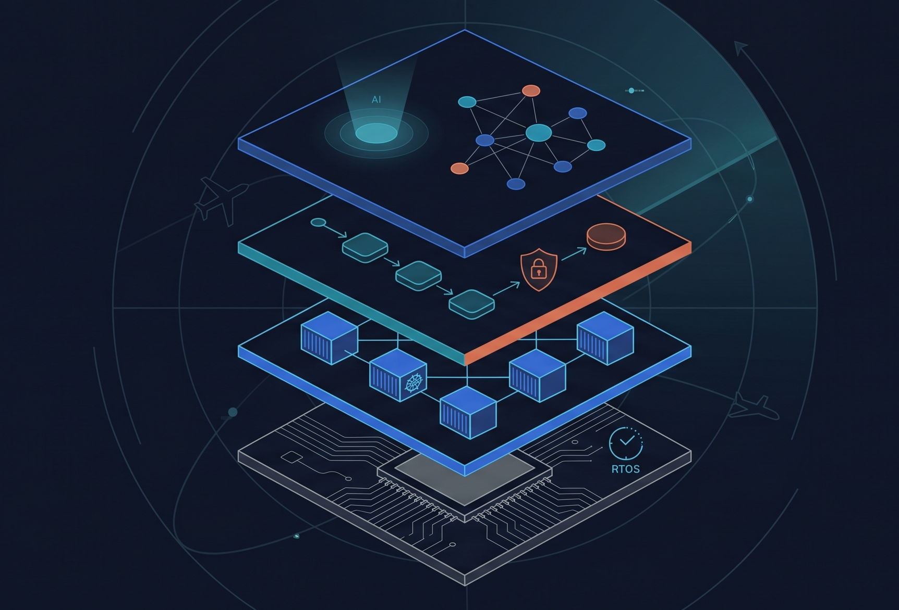

## Hi, I'm Bertrand 👋 🇫🇷

**Platform engineer for safety-critical systems** — I build platforms of all sorts, from **real-time kernels** to **cloud-native** and **DevSecOps**. Now **diving into AI-powered engineering**.

Whatever the layer — a real-time microkernel, a Kubernetes paved road, or a DevSecOps pipeline — what I really enjoy is building the tools and designs that enable and empower other engineers to do their best work. These days I treat the LLM agent as part of the toolchain, and I'm wiring a "second brain" to stay ahead of the firehose.

- 🔭 Building a **cloud platform for safety-critical applications**
- 🧠 Wiring a **second brain** for tech-knowledge management — staying current with new tech: RSS → data ingestion → agent processing (Claude API) → web reporting (Telegram + a custom React front end)
- 🌱 Learning **functional programming**, **agent-native workflows** (skills + MCP), and **building a custom LLM from scratch** — just to understand how it works
- 💬 Ask me about **Kubernetes platforms**, **DO-178C / DO-278A**, or **kernel & operating-system architecture**

 

### ⚙️ Tech

**Languages**

**Cloud-Native & Platform**

**DevSecOps & Infrastructure as Code**

-1A7F37?style=flat-square)

**Embedded · Real-Time · Safety-Critical**

-0091BD?style=flat-square&logo=arm&logoColor=white)

**AI-Powered Engineering**

**Daily Driver**

### 🤝 Connect

